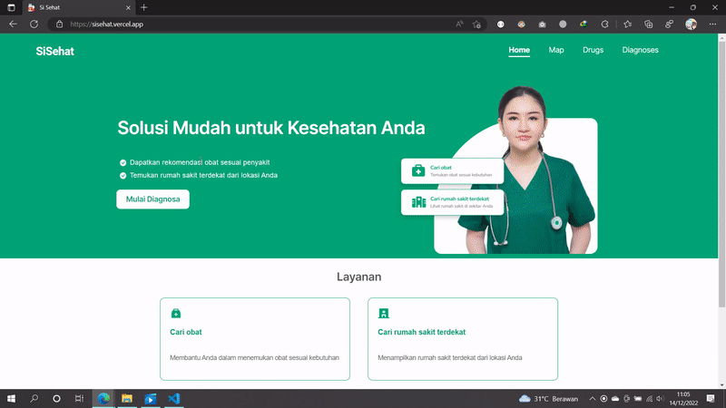

# SiSehat - Hadapi penyakit dengan mudah

SiSehat merupakan aplikasi berbasis website  
yang berfungsi untuk memberikan rekomendasi obat berdasarkan gejala penyakit yang  
dimasukkan pengguna. Aplikasi akan menampilkan rekomendasi obat yang cocok  
untuk penyakit tersebut. Selain fitur rekomendasi obat, terdapat juga fitur untuk  
memberikan informasi terkait rumah sakit dan apotek terdekat. Dengan aplikasi ini,  
diharapkan dapat memberikan kemudahan bagi pengguna dalam menjalani proses  pengobatan penyakit.

[Design UI/UX by Musa & Putri](https://www.figma.com/file/DjAi2w4tduhSyrbDmjR8R0/SiSehat?node-id=1%3A3)

## Cara Mendiagnosa Penyakit

Kami menyediakan fitur untuk mendiagnosa penyakit berdasarkan gejala yang dimasukan oleh user (pasien), user cukup memasukan gejala apa yang dideritanya, sistem akan mencarikan penyakit dan obat yang sesuai dengan penyakit 

> Note: Data yang ada didalam database masih sangatlah terbatas mohon maaf, namun untuk sementara untuk mendiagnosa bisa menggunakan keyword `lemas`
